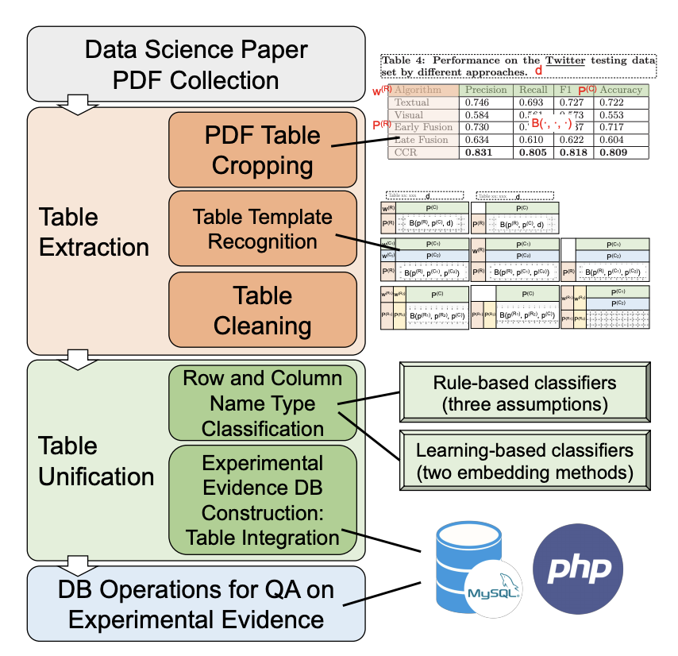
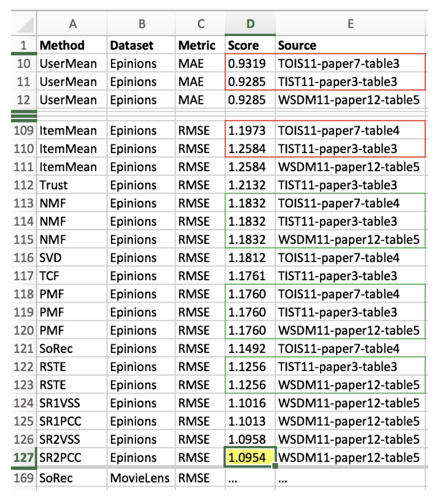

# Tablepedia: Annotated dataset for WWW 2020 paper 


**[Experimental Evidence Extraction in Data Science with Hybrid Table Features and Ensemble Learning](https://wyu97.github.io/papers/C2_WWW_2020.pdf)** <br>
Authors: Wenhao Yu (ND), Wei Peng (ZJU), Yu Shu (SCU), Qingkai Zeng (ND), Meng Jiang (ND)

> This paper propose a novel system that _extracts_ experimental evidences from data science literature in PDF format and _builds up_ the first experimental database for related research.


## Workflow and Example DB constructed by Tablepedia

   
  
- The left figure is the workflow of Tablepedia system: (1) PDF collection, (2)table extraction, (3) experimental evidence database construction, (4)database operations and visualization.

- The right figure is an example DB constructed by Tablepedia from data science paper PDFs. For a dataset and an evaluation metric, one can use the database to check what the state-of-the-art (highlighted in yellow) is and whether the reported numbers in existing research are consistent (green box) or conflicting (red box).


## Reference
```
@inproceedings{yu2020experimental,
  title={Experimental Evidence Extraction System in Data Science with Hybrid Table Features and Ensemble Learning},
  author={Yu, Wenhao and Peng, Wei and Shu, Yu and Zeng, Qingkai and Jiang, Meng},
  booktitle={Proceedings of The Web Conference 2020},
  pages={951--961},
  year={2020}
}
```


## Contact
 Please contact Wenhao Yu (wyu1@nd.edu) if you have any questions.
